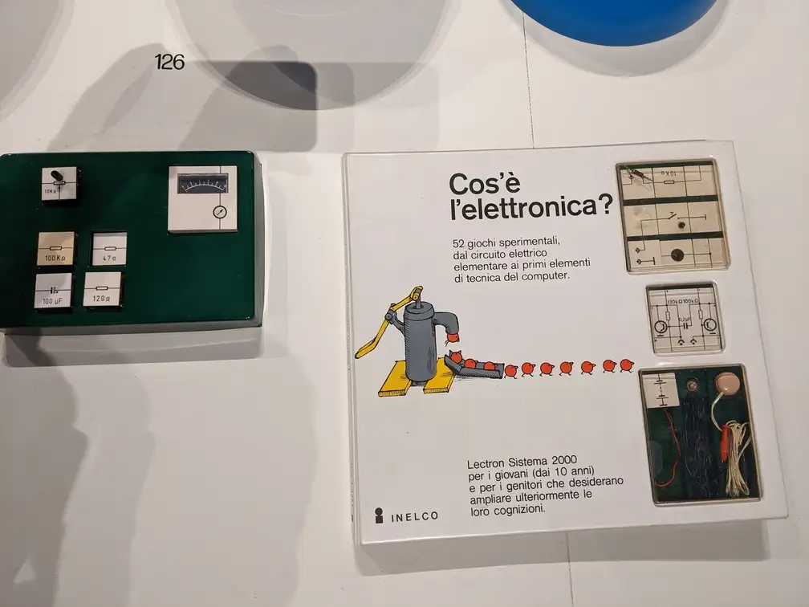

I was thinking of resuming some hobby projects of mine with Arduino which I left incompleted (not to mention the Arduino starter kit itself, coff coff...) when I stumbled upon the following question on StackExchange:

> [What was there before Arduino?](https://electronics.stackexchange.com/questions/66785/what-there-was-before-arduino)

The question got a single answer which focuses on the history of [SBCs](https://en.wikipedia.org/wiki/Single-board_computer), but a comment from the user @Passerby points out (with good reason) that it ignores the history of dev kits. 

This brief comment reminded me of something I saw when I visited the [ADI Design Museum](https://www.adidesignmuseum.org/) in Milan two years ago: an ancient dev kit consisting of modules, in the form of dice, that you could combine to build an electronic circuit. 

You can see a photo of it I took that day (2022/12/28, to be exact) below:

{:.centered}

I was really impressed to discover this piece of history (~1973) in the museum which closely resembled an Arduino kit in its form and its spirit. 

Actually, I was expecting to find there some Arduino boards besides the beloved Olivetti typewriters. Its brand is iconic as much as Olivetti. It was even conceived at [Ivrea](https://medium.com/@danielstone/olivettis-ivrea-how-an-italian-tech-giant-built-the-world-s-most-progressive-company-town-557cb035c383), the company town where [Adriano Olivetti](https://artsandculture.google.com/story/adriano-olivetti-fondazione-adriano-olivetti/mwUhh8o5e-foJA?hl=en) was building its humanist techno-utopia. 

Probably the Arduino hardware itself was not so innovative as its development environment (its IDE and CLI, its DSL to hide C++, etc.). But in the end, Arduino is primarily a product of **design**, just like the boards, shields, carriers, kits and various accessories manufactured by other companies/foundations like Raspberry Pi, Adafruit, etc.

> In the true sense of the word: a sleek interface for an action to perform, where [form follows function](https://en.wikipedia.org/wiki/Form_follows_function).

Nowadays we have recognized a certain inner beauty in these artifacts which was also magnifically depicted in a recent book published by No Starch Press (["Open Circuits"](https://nostarch.com/open-circuits), by Windell Oskay and Eric Schlaepfer). 

Nonetheless, there were no signs of all these things in the museum except for this mysterious object whose name can be read on the kit package: **Lectron Sistema 2000**.

The complete text reads (translated from Italian):

> What is electronics?
>
> 52 experimental games, from the elementary electrical circuit to the first principles of computer technics.
>
> Lectron System 2000 for young kids (since 10 years old) and for parents who want to expand their knowledge.

Unfortunately, the artifact was not accompanied by any kind of explanation that could help the uninformed visitor. I got what follows by googling around.

The story of this object is very intricate and it's only thanks to [Michael Peters](https://lectron.info/lectron-info-update/), a passionate "lectroneer", if we know something more about it. According to him, the original inventor of the Lectron System was a German engineer named Georg Franz Greger and this product was initially manufactered and saled by a German company named Egger-Bahn in Germany during the fall of 1966. It was then distributed and marketed in many countries by different companies, also with different names (Egger Lectron, Braun Lectron, Raytheon Lectron, etc.). The exemplar in the photo bears the name [INELCO](https://lectron.info/inelco-intro/) visible on the bottom-left corner of the case. The company had been distributing the product in Italy since the early 1970s.

It's hard to imagine a market for an educational kit to learn electronics in those years. Indeed, the product had little success and that's the reason why this project is almost forgotten today, although those lucky kids who were gifted with a Lectron still remember it with fondness.

For example, Michael Peters devoted a whole (old-fashioned) site to the Lectron: [lectron.info](https://lectron.info). You are more then welcomed to visit his site, which hosts also a forum where lectroneers from all the corners of the world can meet and talk.

On Youtube you can find people who show off how Lectron System used to work in practice:
<iframe class="container" src="https://www.youtube.com/embed/pjpDK85DRbI" title="Lectron System  - P1 -  Overview   A Fast and Easy Way To Experiment With Electronics" frameborder="0" allow="accelerometer; autoplay; clipboard-write; encrypted-media; gyroscope; picture-in-picture; web-share" referrerpolicy="strict-origin-when-cross-origin" allowfullscreen></iframe>

And you can even buy a Lectron like [this one](https://www.ebay.it/itm/256693199415?_skw=lectron+system&itmmeta=01JBJDAJ34SYFJ52E8Q90JDB7A&hash=item3bc41b6237:g:utkAAOSwfEFnEmjz&itmprp=enc%3AAQAJAAAA0HoV3kP08IDx%2BKZ9MfhVJKn%2BdC3c9YNzjqQB8sPnEFUwsLnieew%2FpqabW1z0HoRquX8MDYbntwkul9GBFQu%2Ba5If22lfpmQkFQUGAkfJbxpX523WNCtuUQrKLJnvKGHjd84ge3srfF%2Bn6xaoNZwCvHm4JoY1TB7jEqveApclhZ6AALUutk2C1uu0E5OH%2Bfd9MumA0De1g11sF7Nl6gZ%2FYQbRAopoU87gHhxlklNRew5V5W1RyK0PUvNmW%2FJs8UL%2BrL%2BZimRAs7336IuVNce7C5c%3D%7Ctkp%3ABk9SR9Chqs3cZA) on eBay if this article has intrigued you.

---

References:
- [Raytheon Lectron](https://en.wikipedia.org/wiki/Raytheon_Lectron) (Wikipedia)
- [The Braun Lectron System: Retro “Circuit Dominoes”](https://makezine.com/article/maker-news/the-braun-lectron-system-retro-circuit-dominoes/) (Make:)
- [Electronic Dominoes, The Fun Way to Learn Electronics!, article reproduced from Electronics Illustrated (issued on September 1967)](http://www.decodesystems.com/lectron.html) (decodesystems.com)

